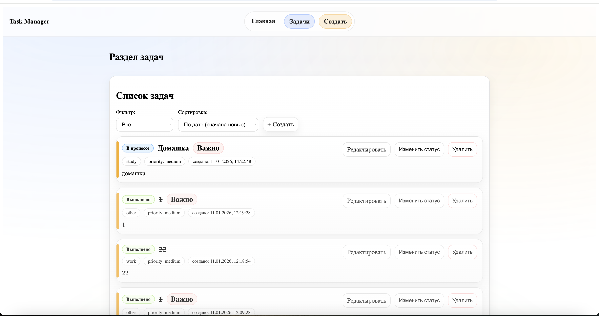
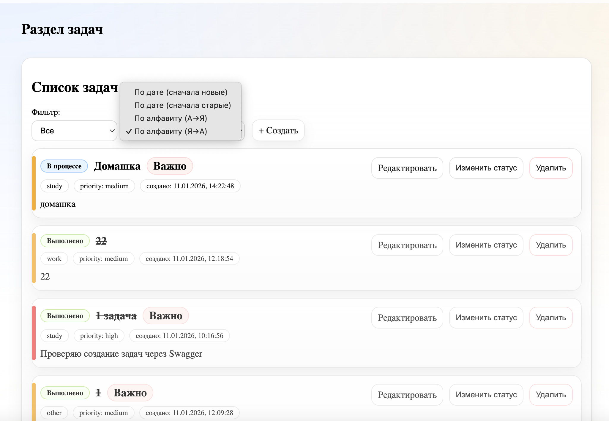
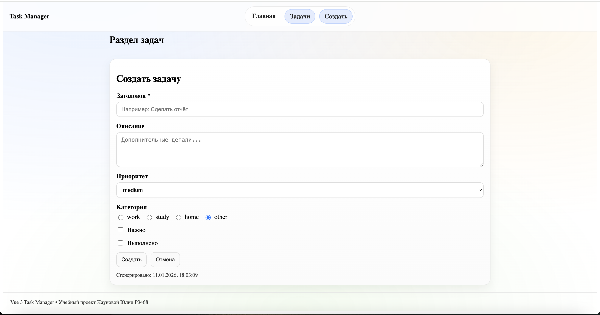
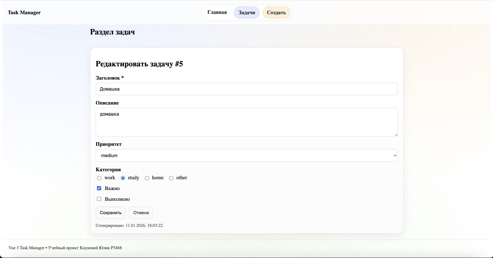
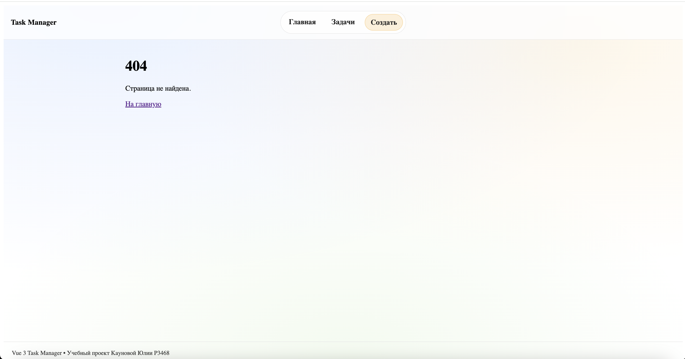

# Отчёт по практической работе: «Менеджер задач» (Vue 3) + Backend (FastAPI) + Docker

**Автор:** Каунова Юлия Денисовна 
**Группа:** P3468 
**Дата:** 11.01.2026  
**Название работы:** Разработка SPA-приложения на Vue 3 с сервером на Python (FastAPI) и запуском в Docker

## 1. Цель работы

Цель работы — разработать мини‑приложение **Task Manager** (менеджер задач) в формате SPA и закрепить навыки работы с Vue3, изучить маршрутизацию Vue Router (маршруты, вложенные маршруты, именованные маршруты, программная навигация, страница 404, взаимодействие с сервером и серверную часть.

## 2. Краткое описание проекта

Приложение состоит из двух частей:
- **Frontend** (Vue 3 + Vite): пользовательский интерфейс, страницы, формы, компоненты, маршруты.
- **Backend** (FastAPI): REST API для CRUD‑операций над задачами и сохранение данных в `backend/tasks.json`.

**Доступы при запуске через Docker Compose:**
- Frontend: `http://localhost:8080`
- Backend (Swagger UI): `http://localhost:8000/docs`


## 3. Реализованный функционал

### 3.1. Frontend (Vue 3)

#### Реализованные страницы 

#### 1) Главная страница / HomePage.vue
 приветственный экран и переход к задачам.

Ключевой код — программная навигация:
```js
import { useRouter } from "vue-router";
const router = useRouter();
function goToTasks() {
  router.push({ name: "tasks" });
}
```


#### 2) Layout для раздела задач — TasksLayout.vue
**Маршрут-родитель:** `/tasks`  
**Главное:** демонстрация **вложенных маршрутов** — этот layout всегда виден, а внутри него меняются дочерние страницы.

Ключевой код — место для дочерних страниц:
```vue
<RouterView />
```
Также в layout удобно держать кнопки/ссылки “внутри раздела задач”, например:
```vue
<RouterLink :to="{ name: 'task-new' }">+ Новая задача</RouterLink>
```
#### 3) Список задач — TasksPage.vue
**Маршрут:** `/tasks` (name: `tasks`)  
**Главное:** загрузка задач с сервера + фильтрация и сортировка (через `computed`) + обработчики CRUD.

Ключевой код — `computed` для фильтрации:
```js
const filteredTasks = computed(() => {
  if (statusFilter.value === "completed") return tasks.value.filter(t => t.completed);
  if (statusFilter.value === "active") return tasks.value.filter(t => !t.completed);
  return tasks.value;
});
```

Ключевой код — `computed` для сортировки  
```js
const sortedAndFilteredTasks = computed(() => {
  const arr = [...filteredTasks.value];
  arr.sort((a, b) => String(b.created_at).localeCompare(String(a.created_at)));
  return arr;
});
```

Ключевой код — вывод `TaskItem` (props + emit):
```vue
<TaskItem
  v-for="task in sortedAndFilteredTasks"
  :key="task.id"
  :task="task"
  @delete="removeTask"
  @toggle="toggleTaskStatus"
/>
```


#### 4) Создание задачи — TaskNewPage.vue
**Маршрут:** `/tasks/new` (name: `task-new`)  
**Главное:** использует общий компонент формы `TaskForm.vue`, при submit отправляет `POST` на backend.

Ключевой код — отправка:
```js
import { apiCreateTask } from "../api/tasks";

async function createTask(payload) {
  await apiCreateTask(payload);
  router.push({ name: "tasks" });
}
```

#### 5) Редактирование задачи — TaskEditPage.vue
**Маршрут:** `/tasks/:id/edit` (name: `task-edit`)  
**Главное:**
- берёт `id` из URL (через `props: true` в роутере),
- загружает задачу `GET /api/tasks/{id}`,
- отправляет изменения `PUT /api/tasks/{id}`.

Ключевой код — загрузка задачи:
```js
import { apiGetTask, apiUpdateTask } from "../api/tasks";

onMounted(async () => {
  initial.value = await apiGetTask(props.id);
});
```

Ключевой код — сохранение:
```js
async function saveTask(payload) {
  await apiUpdateTask(props.id, payload);
  router.push({ name: "tasks" });
}
```


#### 6) Страница 404 — NotFoundPage.vue
**Маршрут:** `/:pathMatch(.*)*` (name: `not-found`)  
**Главное:** отображается при неизвестном пути и даёт ссылку на главную.

Ключевой код (роутер):
```js
{ path: "/:pathMatch(.*)*", name: "not-found", component: NotFoundPage }
```


### 3.2. Компоненты 

#### 1) `AppHeader.vue` — верхняя навигация
Показывается на всех страницах (находится в `App.vue`).

**Пример использования (App.vue):**
```vue
<AppHeader />
<RouterView />
<AppFooter />
```
навигация выполнена через `RouterLink`, поэтому переходы происходят без перезагрузки страницы (SPA‑поведение).


#### 2) `LayoutCard.vue` — компонент со слотами (обычный + именованный + scoped)
Этот компонент используется как “карточка‑обёртка” для страниц и демонстрирует **слоты**:

- **Обычный слот**: основной контент карточки
- **Именованные слоты**: `header`, `footer`
- **Scoped slot**: в `footer` передаётся значение `now` (пример “слота с ограниченной областью видимости”)

**Пример (HomePage.vue):**
```vue
<LayoutCard>
  <template #header><h2>...</h2></template>

  <p>Контент</p>

  <template #footer="{ now }">
    <small>Время: {{ now }}</small>
  </template>
</LayoutCard>
```

#### 3) `TaskItem.vue` — карточка одной задачи (props + emit)
Компонент получает объект задачи через `props` и отправляет события наверх через `emit`.

- `props`: `task`
- `emit`: `delete` (удаление), `toggle` (изменение статуса)
- отображает дату создания (`created_at`) и “бейджи” (priority/category/important)

**Кусочек кода (emit событий):**
```vue
<button class="btn" @click="$emit('toggle', task)">Изменить статус</button>
<button class="btn danger" @click="$emit('delete', task.id)">Удалить</button>
```
 состояние (список задач) хранится на странице `/tasks`. Компонент `TaskItem` только сообщает “что произошло”, а родитель решает, как обновить данные и сделать запрос к API.


#### 4) `TaskList.vue` — список задач (v-for + v-if + проброс событий)
Компонент принимает массив задач и рисует список через `v-for`.
Также реализовано “пустое состояние” через `v-if`.

**Пример кода (v-if + v-for):**
```vue
<p v-if="tasks.length === 0">Список пуст. Создай первую задачу 🙂</p>

<TaskItem
  v-for="task in tasks"
  :key="task.id"
  :task="task"
  @delete="$emit('delete', $event)"
  @toggle="$emit('toggle', $event)"
/>
```

#### 5) `TaskForm.vue` — форма создания/редактирования
Один компонент формы переиспользуется на двух страницах: `/tasks/new` и `/tasks/:id/edit`.

**Поля формы:**
- `title` (input) — обязательное
- `description` (textarea)
- `priority` (select)
- `category` (radio)
- `important` (checkbox)
- `completed` (checkbox)

**Пример `v-model` с модификатором `.trim`:**
```vue
<input v-model.trim="local.title" placeholder="Например: Сделать отчёт" />
```

**Валидация (пример):**
```js
if (!local.title) {
  errors.title = "Заголовок обязателен";
}
```

Форма получает `initialValue` через `props`, а `props` нельзя изменять. Поэтому создаётся локальное состояние `local`, с которым работает `v-model`.  
Чтобы при загрузке задачи на странице редактирования форма обновилась, используется `watch` на `props.initialValue`.


### 3.3. Реализация computed / watch

#### `computed` (пример: фильтрация и сортировка на странице `/tasks`)
На странице списка задач вычисляются:

- `filteredTasks` — фильтрация по статусу
- `sortedAndFilteredTasks` — сортировка по выбранному режиму

**Фрагмент `computed` (фильтрация):**
```js
const filteredTasks = computed(() => {
  if (statusFilter.value === "completed") return tasks.value.filter(t => t.completed);
  if (statusFilter.value === "active") return tasks.value.filter(t => !t.completed);
  return tasks.value;
});
```

**Фрагмент `computed` (сортировка):**
```js
const sortedAndFilteredTasks = computed(() => {
  const arr = [...filteredTasks.value]; // важно: делаем копию, sort() мутирует массив
  arr.sort((a, b) => String(b.created_at).localeCompare(String(a.created_at)));
  return arr;
});
```
---

#### `watch` (отслеживание фильтра/сортировки)
На странице `/tasks` используется `watch`, чтобы реагировать на изменения выбранных параметров (например, для логов или очистки ошибки).

**Фрагмент `watch`:**
```js
watch([statusFilter, sortMode], () => {
  errorMessage.value = "";
});
```

### 3.4. Маршрутизация (Vue Router)

#### Созданные маршруты

- `name: "home"` → `/` → `HomePage.vue`
- `name: "tasks"` → `/tasks` → `TasksPage.vue`
- `name: "task-new"` → `/tasks/new` → `TaskNewPage.vue`
- `name: "task-edit"` → `/tasks/:id/edit` → `TaskEditPage.vue`
- `name: "not-found"` → `/:pathMatch(.*)*` → `NotFoundPage.vue`

#### Вложенные маршруты
Маршруты `/tasks/*` являются **дочерними** у родительского маршрута `/tasks`, который использует `TasksLayout.vue`.

**Фрагмент из `router.js` (children):**
```js
{
  path: "/tasks",
  component: TasksLayout,
  children: [
    { path: "", name: "tasks", component: TasksPage },
    { path: "new", name: "task-new", component: TaskNewPage },
    { path: ":id/edit", name: "task-edit", component: TaskEditPage, props: true },
  ],
}
```

#### Именованные маршруты и программная навигация
Используются `name`, чтобы навигация не зависела от строковых путей.

**Пример программной навигации (HomePage.vue):**
```js
router.push({ name: "tasks" });
```

#### Страница 404
Используется маршрут‑перехватчик:

```js
{ path: "/:pathMatch(.*)*", name: "not-found", component: NotFoundPage }
```

### 3.5. Взаимодействие с сервером (Axios)

Создан отдельный слой API в `frontend/src/api/`:

- `http.js` — экземпляр Axios (`baseURL`, `timeout`)
- `tasks.js` — функции для CRUD

**Пример `tasks.js`:**
```js
export async function apiGetTasks() {
  const { data } = await http.get("/api/tasks");
  return data;
}
```

## 4. Серверная часть (FastAPI)

### 4.1. Реализованные эндпоинты CRUD

- `GET /api/tasks` — список всех задач  
- `GET /api/tasks/{id}` — получить задачу по id  
- `POST /api/tasks` — создать задачу  
- `PUT /api/tasks/{id}` — обновить задачу  
- `DELETE /api/tasks/{id}` — удалить задачу  

### 4.2. Хранение данных: `tasks.json`

Данные сохраняются в `backend/tasks.json`.  
Файл обновляется после операций (создание/обновление/удаление), чтобы его можно было открыть вручную и увидеть актуальное содержимое.


## 5. Пример данных (tasks.json)

Пример содержимого файла `backend/tasks.json`:

```json
[
  {
    "id": 1,
    "title": "Создать Vue-компонент",
    "description": "Сделать TaskItem и TaskList",
    "priority": "high",
    "category": "study",
    "important": true,
    "completed": false,
    "created_at": "2026-01-11T10:00:00"
  }
]
```

## 7. Docker

```bash
docker compose build
docker compose up
```

### Адреса
- Frontend: `http://localhost:8080`
- Backend (Swagger): `http://localhost:8000/docs`

## 8. Выводы

В ходе практической работы было изучено и закреплено:

- основы Vue 3: компоненты, реактивность, `computed`, `watch`;
- работа с формами: `v-model`, модификаторы, валидация, submit/cancel;
- взаимодействие компонентов: `props` и события `emit`;
- Vue Router: вложенные маршруты, именованные маршруты, программная навигация, 404;
- работа с REST API через Axios и выделение слоя API;
- создание backend на FastAPI с CRUD и хранением данных в JSON;
- контейнеризация приложения: Dockerfiles, Nginx для фронта, запуск через Docker Compose.


